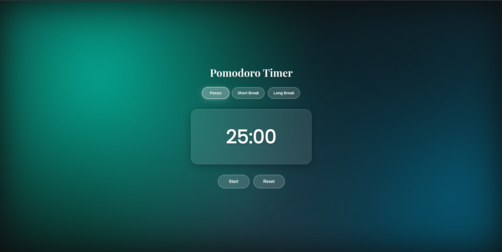

# ⏳ Pomodoro Timer

A beautifully designed **Pomodoro Timer** built with HTML, CSS, and JavaScript.  
Stay focused, boost productivity, and track your work/break sessions in style.  

 <!-- Replace with your screenshot path -->

---

## ✨ Features
- 🎨 **Aesthetic UI** – Glassmorphism & colorful gradient backgrounds
- ⏱ **Pomodoro Mode** – 25-minute focus sessions
- ☕ **Break Mode** – Short & long breaks for better productivity
- 📱 **Responsive Design** – Works on desktop & mobile
- 🖱 **Interactive Buttons** – Smooth hover effects & active states
- ⚡ **Lightweight & Fast** – No frameworks, just pure HTML/CSS/JS

---

## 🚀 Getting Started

### 1. Clone the Repository
```bash
git clone https://github.com/your-username/pomodoro-timer.git
cd pomodoro-timer
